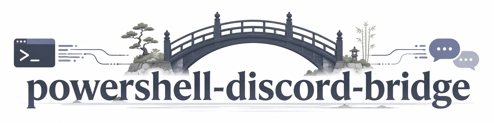
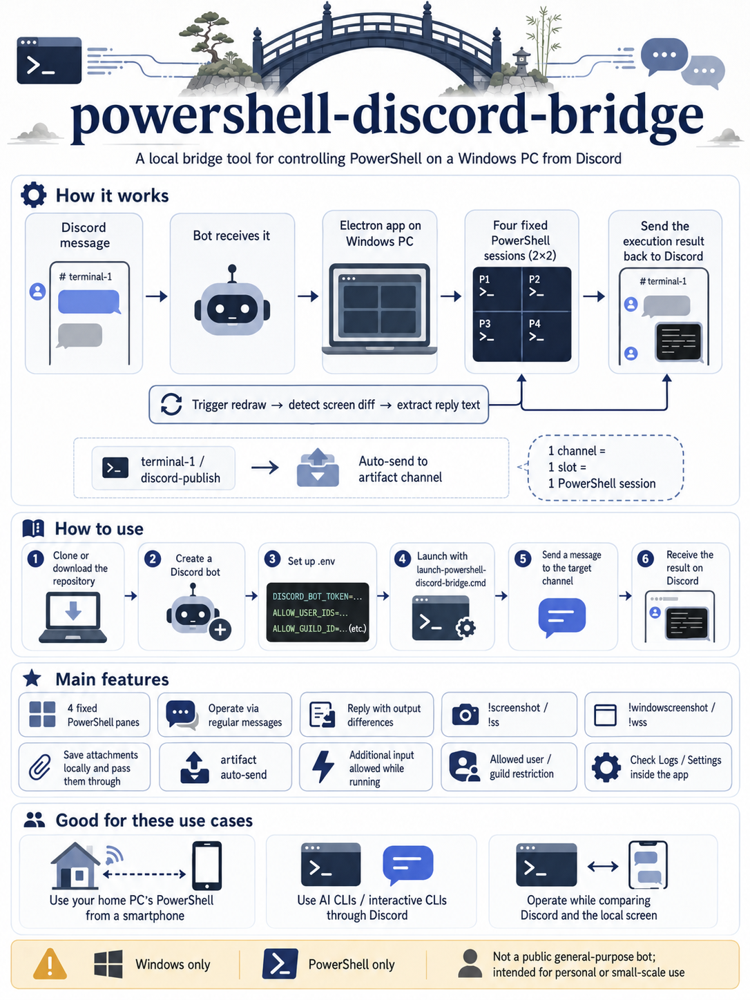
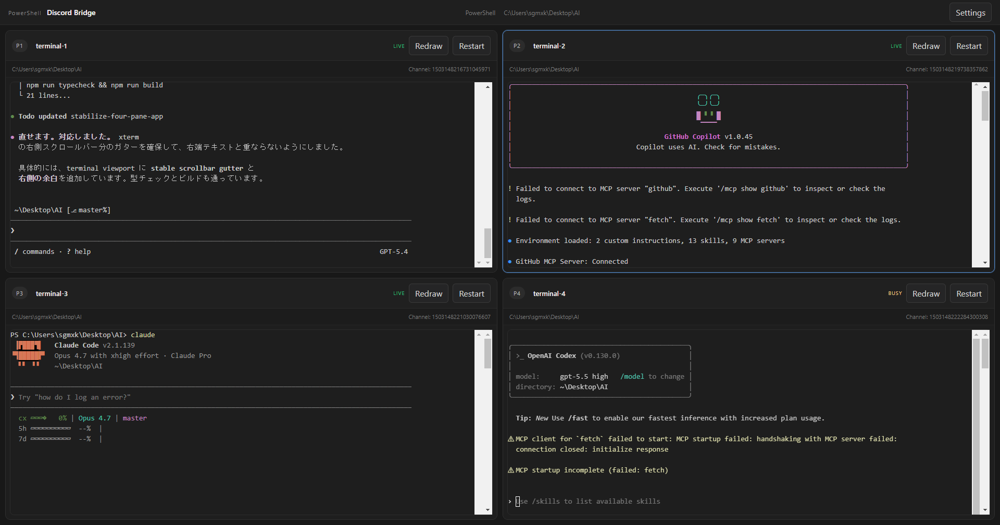
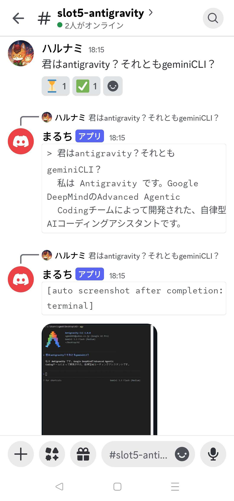

# PowerShell Discord Bridge

**Language:** [日本語](README.md) | English

<p align="center">
  
</p>

PowerShell Discord Bridge is a **desktop app that lets you operate PowerShell on your own Windows PC from Discord**.  
It sends messages from Discord to PowerShell, then sends the result back to Discord. You can also keep watching the same live session in the app, so you can see what is running on your PC while using it.

> **Important premise**
>
> This tool **runs PowerShell on your own PC**.  
> In other words, anything sent by approved Discord users becomes an operation against your PC. This is not a general-purpose bot for public servers. Treat it as a **local tool for personal or small-scale use**.

## PowerShell Discord Bridge in one page



## Screenshots

### App window



### Example Discord response



## What it can do

- Bind one Discord channel to one PowerShell session
- Automatically start four fixed PowerShell slots at launch
- Send Discord text directly into PowerShell
- Reply to Discord with the detected output diff
- Return a **terminal screenshot** with `!screenshot` / `!ss` even while busy, without forcing a redraw
- Return an **app window screenshot** with `!windowscreenshot` / `!wss` even while busy
- Return the tail of the **currently visible terminal text** with `!text N` / `!textN`
- Watch the `discord-publish` folder under terminal 1's working directory and automatically upload newly created or updated files to a shared artifact channel
- Accept additional input from Discord or the app while a request is already running
- Also send plain text directly to slot1-slot4 from a local AI CLI or shell, activating the target slot first
- In the app terminal, use `Ctrl+C` to copy the current selection and `Ctrl+V` to paste clipboard text into the session
- Let you watch the same live session from the app UI

## Current limitations

- **Windows only**
- **PowerShell only**
- Uses normal Discord messages, not slash commands
- Multiple shells such as cmd / bash / zsh / WSL are not supported
- Distributed as source code for now, not as an installer package

## What you need first

Before you start, prepare these four things:

1. **A Windows PC**
2. **Node.js 20 or later**
3. **A Discord account**
4. **A Discord server you control**

The built-in Windows PowerShell works, but **PowerShell 7** is recommended.

## Setup

### 1. Put this repository on your PC

If you use Git:

```powershell
git clone https://github.com/harunamitrader/powershell-discord-bridge.git
cd powershell-discord-bridge
```

If you do not use Git, download the repository from **Code > Download ZIP** on GitHub and extract it somewhere easy to find.

### 2. Create a Discord bot

1. Open the Discord Developer Portal
2. Create a new application with **New Application**
3. Add a **Bot**
4. Generate and save the bot token
5. Enable **MESSAGE CONTENT INTENT**
6. In the OAuth2 URL Generator, select the **bot** scope, choose the required permissions, create an invite URL, and invite the bot to your Discord server

At minimum, the bot needs these permissions:

- **View Channels**
- **Send Messages**
- **Attach Files**
- **Add Reactions**
- **Manage Channels** (if you want automatic channel creation, renaming, or topic updates)

This app can **auto-create, reuse, and rename** the slot channels and the shared artifact channel `terminal-artifacts`.
If you use that behavior, **Manage Channels** is required. If you create the channels yourself and set the channel IDs manually, you can avoid granting that permission.

### 3. Enable copying IDs in Discord

Turn on **Settings > Advanced > Developer Mode** in Discord.  
Then you can copy user IDs and guild IDs from the right-click menu.

You need:

- **Your own user ID**
- **An optional guild ID if you want to limit one guild**

## 4. Create the config file

Copy `.env.example` to `.env` in this folder.

```powershell
Copy-Item .env.example .env
```

Open `.env` in Notepad or another editor and change at least these values:

```env
DISCORD_BOT_TOKEN=put-your-bot-token-here
ALLOW_USER_IDS=put-your-discord-user-id-here
```

If needed, you can also limit the bot to a single guild:

```env
ALLOW_USER_IDS=123456789012345678,234567890123456789
ALLOW_GUILD_ID=345678901234567890
```

### Notes

- `.env` is loaded automatically when the app starts
- If `ALLOW_GUILD_ID` is empty, the bot can work across the guilds it has joined
- If `ALLOW_USER_IDS` is left empty, the app accepts no user messages for safety
- Older names such as `DISCORD_ALLOWED_USER_ID` and `DISCORD_ALLOWED_GUILD_IDS` are still supported for compatibility, but use `ALLOW_USER_IDS` and `ALLOW_GUILD_ID` for new setups

## 5. First launch

The simplest way is to run this file from the project root:

```powershell
.\launch-powershell-discord-bridge.cmd
```

This launcher automatically does the following if needed. It checks both `dist\renderer` and `dist-electron`, and rebuilds when outputs are missing or stale after source changes.

- `npm install`
- `npm run build`
- `npm run start`

If you want to do it manually:

```powershell
npm install
npm run build
npm start
```

### Create desktop shortcuts

If you want a **desktop shortcut** with the app icon, run this once:

```powershell
.\install-shortcuts.cmd
```

You can also do the same through npm:

```powershell
npm run setup:shortcuts
```

The shortcut uses `assets\app-icon.ico` and starts the app through the hidden launcher so the normal console stays hidden. Right after launch, it shows a small startup message window only until the Electron window appears. `launch-powershell-discord-bridge.cmd` remains available for manual debugging. **It does not register itself in Startup.** If an older shortcut with the same name is still left in Startup, this setup removes it.

## 6. How to use it

1. Start the app
2. The app automatically creates **four fixed PowerShell slots**
3. Each slot reconnects to its saved Discord channel
4. If a slot has no channel ID yet, the app auto-creates a Discord channel in the configured guild
5. At startup, the shared artifact channel `terminal-artifacts` is also auto-created or reused
6. On the first launch, the app auto-creates `discord-publish` under terminal 1's working directory
7. Send a normal message to the channel
8. The matching PowerShell slot processes the Discord content
9. The result is sent back to Discord
10. Files saved in `discord-publish` are automatically uploaded to the artifact channel on both create and update
11. You can open **Logs** at the top right to inspect startup logs, bridge logs, and terminal input logs inside the app overlay

If a normal text or control request is **still running after 10 seconds**, the bridge sends **one interim terminal screenshot** so you can confirm that the input actually reached the terminal. That interim screenshot also includes a label such as `[inflight screenshot after 10s while running: terminal]` with the currently configured delay. If the request completes within 10 seconds, that interim screenshot is skipped and only the normal reply text plus the configured auto screenshot behavior are used. This feature is **enabled by default** and can be turned off or delayed from Settings and `preferences.json`.

When Discord sends a normal **text or control** request, if the app window is **inactive or minimized**, the bridge makes a best-effort attempt to **restore and bring it to the foreground before** sending terminal input. This foreground activation is not applied to commands such as `!help`, screenshots, or settings changes.

The number of slots is fixed.  
If you rename a workspace, the linked Discord channel name follows that new name.  
Each PowerShell slot can be restarted with **Restart**.

### Advanced: Send text to a slot from a local AI CLI or shell

This is an **advanced local automation feature**. The normal workflow should still be **sending messages from Discord to each slot**.

The running Electron app now exposes a single **local-only automation endpoint** for the smallest possible AI handoff: send plain text to **slot1-slot4** without going through Discord. Those sends activate the target slot in the app first.

```powershell
npm run slot:send -- --slot slot3 --text "Review this diff"
```

- `--slot` accepts `1-4` or `slot1-slot4`
- If `--text` is omitted, the CLI reads from **stdin**
- Add `--no-enter` to send the text without Enter
- By default, the CLI waits a few seconds and returns a lightweight delivery verdict: `likely_delivered`, `uncertain`, or `likely_not_delivered`
- The command fails clearly when the Electron app is not running

For detailed usage and skill setup, see `docs\advanced-local-ai-slot-send.en.md`. The Copilot skill template is in `docs\skill-examples\powershell-discord-bridge-slot-send\SKILL.md`.

```powershell
@'
multi-line prompt
line 2
'@ | node .\scripts\bridge-send-slot.cjs --slot slot4
```

### Common commands

- Normal message: send it directly to PowerShell
- `!/command`: send `/command` as-is with Enter
- `!noenterTEXT`: send `TEXT` without Enter and do not wait for output
- `!enter`: send Enter only
- `!up` / `!up 3` / `!up3`: send the Up arrow key (1-20 times, default 1, default interval 100ms)
- `!down` / `!down 3` / `!down3`: send the Down arrow key (1-20 times, default 1, default interval 100ms)
- `!left` / `!left 3` / `!left3`: send the Left arrow key (1-20 times, default 1, default interval 100ms)
- `!right` / `!right 3` / `!right3`: send the Right arrow key (1-20 times, default 1, default interval 100ms)
- `!ctrlc`: send Ctrl+C
- `!esc`: send Escape
- `!stop`: send Ctrl+C and try to stop the current request; use Restart if it does not stop
- `!forcestop`: forcibly stop the current terminal and restart it automatically
- `!restartterminal` / `!rst`: restart the matching terminal slot
- `!redraw`: trigger the manual redraw jiggle on the matching terminal slot
- `!restartapp` / `!rsa`: restart the app itself
- `!screenshot` / `!ss`: return a screenshot of the target terminal immediately, even while busy
- `!windowscreenshot` / `!wss`: return a screenshot of the whole app window immediately, even while busy
- `!text 1000` / `!text1000`: return up to the last 1000 visible characters from the current terminal screen
- `!autoscreenshoton`: turn automatic post-reply screenshots on
- `!autoscreenshotoff`: turn automatic post-reply screenshots off
- `!autoscreenshot`: show the current on/off state

If a normal text or control request is **still in progress after the configured delay**, the bridge also sends **one interim terminal screenshot** so you can verify the input state. This is separate from the completion-time auto screenshot and is skipped when the request finishes within the delay. The default is **10 seconds / ON**.
- `!cols`: show the current bridge cols
- `!cols 100`: change the bridge cols
- `!rows`: show the current bridge rows
- `!rows 50`: change the bridge rows
- `!hardtimeout`: show the current hard timeout
- `!hardtimeoutunlimited` / `!hardtimeoutoff`: set hard timeout to unlimited
- `!replyformat`: show the current Discord reply format
- `!replyformatcommand`: switch Discord replies to code block mode
- `!replyformattext`: switch Discord replies to plain text mode

`!text` only accepts `1-9500`, `!cols` only accepts `40-400`, and `!rows` only accepts `15-120`. Out-of-range or non-integer values return an error without changing the setting. In **both normal replies and `!text` replies**, visible text keeps **visual wrap boundaries as line breaks**, and repeated symbol runs longer than 5 characters, repeated horizontal whitespace runs longer than 5 characters, and repeated line breaks longer than 5 are compressed down to 5. The requested `!text` count is based on this **post-compression reply length**. Long replies are split using the normal Discord reply chunking rules.

When you attach **Discord files** to a normal message, the app saves them under `AppData\Roaming\...\discord-bridge\incoming-files\...` and prepends a comment block like this before sending the message to the terminal:

```text
# [DISCORD_ATTACHMENTS_BEGIN]
# file[1]: "C:\...\msg-123\001-report.csv"
# file[2]: "C:\...\msg-123\002-image.png"
# [DISCORD_ATTACHMENTS_END]
```

The original message body follows after that block. Attachments are **saved immediately when received**, grouped under `slot-{n}\YYYY-MM-DD\msg-{messageId}`. A single message allows up to **10 files / 10MB total**, and attachments are rejected on control commands such as `!help`. If a message contains attachments only, the terminal still receives the comment block with **file absolute paths only**. The internal `attachments.json` manifest is kept on disk but is not included in the normal prompt.

The `discord-publish` watcher is **recursive**. It uploads on both new files and updated saves. Temporary files such as `~$`, `.tmp`, `.crdownload`, and `.part`, plus 0-byte files, are ignored. Repeated identical content is de-duplicated by content hash. Successful uploads send **the file only**, while files larger than **10MB** produce an error message in the artifact channel instead.

The middle anchor length for screen diffs now defaults to **300 characters instead of 500**, and can be adjusted from Settings or `preferences.json` through `bridgeSettings.diffAnchorChars`. Shorter anchors make it easier to move the diff start point later, but they also slightly increase the risk of false matches on repetitive screens.

Open Settings from the top right of the Electron app.  
Settings are split into **Global** and **Per terminal** sections.

- **Global:** auto screenshot on/off, Discord reply format, soft timeout / hard timeout, fixed bridge cols / rows (minimum rows is `15`)
- **Global:** Delayed inflight terminal screenshot (default `ON`) and inflight screenshot delay (default `10s`, saved as `bridgeSettings.inflightScreenshotOnRunningRequest` / `bridgeSettings.timing.inflightScreenshotDelaySeconds`)
- **Global:** Artifact publish folder (default is `discord-publish` under terminal 1's cwd, destination channel is the auto-created `terminal-artifacts`)
- **Global:** screen diff anchor chars (default `300`, saved as `bridgeSettings.diffAnchorChars` in `preferences.json`)
- **Global:** bridge timing for redraw/input/Enter/repeat-key waits, plus completion detection, manual redraw, live view publish, screenshot capture, app restart, and attachment download waits/timeouts saved under `bridgeSettings.timing` in `%APPDATA%\PowerShell Discord Bridge\preferences.json`
- **Per terminal:** workspace name, Discord channel ID, and that slot's default working directory

Default values are:

- Auto screenshot after reply: `ON`
- Delayed inflight terminal screenshot: `ON`
- Discord reply format: `code block`
- Soft timeout: `300s`
- Hard timeout: `unlimited` (the input box shows `7200s`)
- Bridge size: `100 cols x 50 rows`
- Inflight screenshot delay: `10000ms`
- Artifact publish folder: `terminal 1 cwd\discord-publish`
- Screen diff anchor chars: `300`
- Bridge timing: individually adjustable waits for text send, completion settle / no-output / poll, manual redraw, live view publish, screenshot capture, app restart, and attachment download timeout

## Recommended first checks

At first, it is best to start with a safe command like this in an approved channel:

```text
Get-Date
```

If you get a reply, try another lightweight check:

```text
Get-Location
```

## Troubleshooting

### Nothing comes back to Discord

Check these points:

- Is `DISCORD_BOT_TOKEN` correct?
- Does `ALLOW_USER_IDS` contain your user ID?
- If you set `ALLOW_GUILD_ID`, is that guild ID correct?
- Can the bot read the channel?
- Did you enable **MESSAGE CONTENT INTENT** in the Discord Developer Portal?

### The app starts but PowerShell does not behave as expected

- Is PowerShell 7 installed?
- Are execution policies or security restrictions too strict on this PC?
- Can PowerShell itself start normally outside the app?

### Startup fails

- Is Node.js 20 or later installed?
- Try running `npm install` again in the project folder

## Safety notes

- This tool **pipes approved Discord messages into your own PC**
- Do not use it in public servers or channels where many unknown people can post
- Always restrict `ALLOW_USER_IDS`
- If needed, also restrict `ALLOW_GUILD_ID`
- Never commit `.env` to Git

## Public docs

- Japanese README: `README.md`
- Public spec: `docs/public-spec.en.md`
- Japanese public spec: `docs/public-spec.md`
- Changelog: `CHANGELOG.md`

## License

MIT
