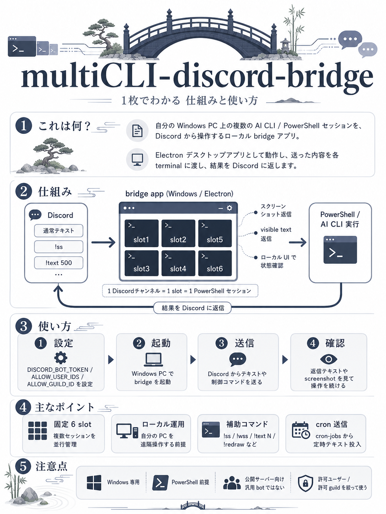
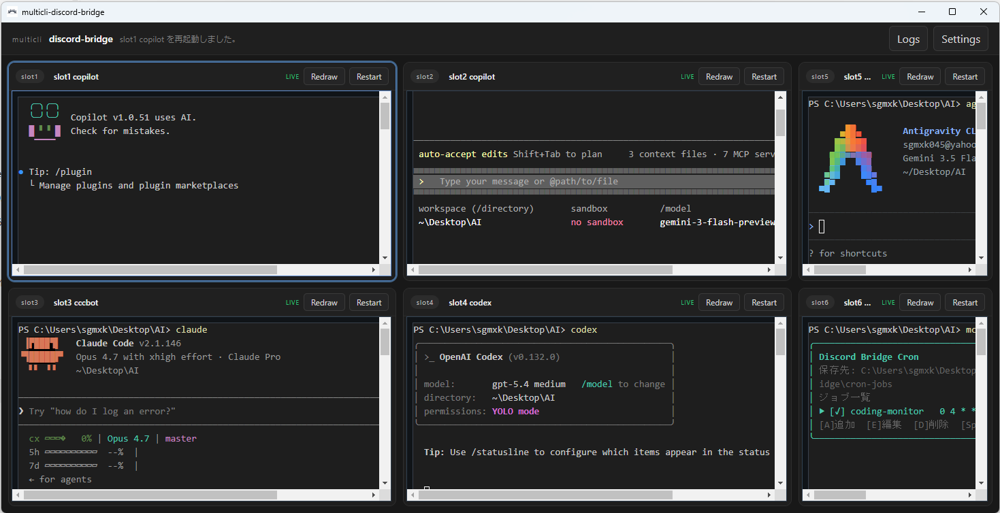

# multicli-discord-bridge

**Language:** 日本語 | [English](README.en.md)

<p align="center">
  
</p>

multicli-discord-bridge は、**複数の AI CLI を 1 つのウィンドウに並べて、Discord から扱えるローカルデスクトップアプリ**です。  
6 つの slot を 1 画面で見ながら、Discord から各 slot に指示を送り、返答や進行状況をそのまま追えます。単に「PC 上のターミナルを遠隔操作する」ためだけでなく、**複数の AI CLI に異なるタスクを同時に並走させ、必要なら slot 同士を連携させる**ことを主目的にしています。

> **大事な前提**
>
> このツールは **あなたの PC 上でローカルの terminal / CLI を実行します**。  
> つまり、許可した Discord ユーザーから送られた内容は、あなたの PC に対する操作になります。公開サーバーに入れる汎用 bot ではなく、**自分用・小規模運用向けのローカル orchestration ツール**として考えてください。

## 図解イメージ

<p align="center">
  
</p>

## 画面イメージ

### UI 全体のイメージ



### Discord 側の返答例


## できること

- 6 つの固定 slot を **1 つのウィンドウ**に並べて同時に監視する（slot5 / slot6 は右側の半幅列）
- 横 1 本・縦 2 本の divider をドラッグして、**表示上の pane サイズだけ** 自由に調整できる（内部 terminal サイズは固定のまま）
- Discord の 1 チャンネルを 1 つの slot にひも付けて、**Discord を操作面**として使う
- Discord に送った文章を、そのまま対象 slot の terminal / CLI に入力する
- 実行結果の差分を Discord に返信し、**離れた場所からでも作業状況を確認**する
- `!screenshot` / `!ss` で **対象 terminal のスクリーンショット**を Discord に返す（busy 中も即時取得、再描画誘発なし）
- `!windowscreenshot` / `!wss` で **アプリ画面全体のスクリーンショット**を Discord に返す（busy 中も即時取得）
- `!text N` / `!textN` で **現在表示中の terminal テキスト末尾**を最大 N 文字まで Discord に返す
- terminal 1 の working directory 直下に作る `discord-publish` フォルダを監視し、新規作成・更新保存したファイルを **共通 artifact チャンネル**へ自動送信する
- 実行中でも Discord / アプリ側から追加入力をそのまま流し込める
- Copilot などの skill テンプレート経由で、**他 slot へのテキスト送信 / 状態確認 / visible text 取得**を標準機能として使える
- slot 間で **テキスト送信 / 状態確認 / visible text 取得 / 必要時のみ完了通知付き依頼** を組み合わせた連携ができる
- **Cron スケジュール**で指定した slot に自動的にコマンドやテキストを送信する（同梱の `bridge-cron-tui` で管理）
- アプリ側の terminal では `Ctrl+C` で選択テキストをコピーし、`Ctrl+V` でクリップボードのテキストを貼り付けられる
- アプリ側でも同じセッション画面を見て、進行状況や出力を確認する

## このアプリが向いている用途

- Copilot CLI / Claude Code / Codex CLI / Gemini CLI / Antigravity CLI などに**異なるタスクを同時並行で走らせたい**
- AI ごとに担当 slot を分けて、**1 つの作業を分担・レビュー・再実行**したい
- 外出先や別 PC から Discord 経由で、自宅 PC 上の AI CLI ワークスペースを触りたい
- 「どの slot が何をしているか」を 1 画面で把握しつつ、必要な slot にだけ追加指示を送りたい

## 現在の制限

- **Windows 専用**
- Discord の slash command ではなく、通常メッセージ入力ベース
- 現在の既定 shell は **PowerShell**（内部実装として利用）
- 複数のシェル（cmd / bash / zsh / WSL など）の切り替えは未対応
- インストーラー付き配布ではなく、**現時点ではソースコードから起動**する形

## 先に用意するもの

導入前に、次のものを用意してください。

1. **Windows PC**
2. **Node.js 20 以降**
3. **Discord アカウント**
4. **自分で管理できる Discord サーバー**
5. **使いたい AI CLI や開発ツール**（任意。Copilot CLI / Claude Code / Codex CLI / Gemini CLI など）

内部では PowerShell を使います。Windows 標準版でも動きますが、**PowerShell 7** を入れておくと扱いやすいです。

## 導入手順

### 1. このリポジトリを PC に置く

Git を使う場合:

```powershell
git clone https://github.com/harunamitrader/multicli-discord-bridge.git
cd multicli-discord-bridge
```

Git を使わない場合は、GitHub の **Code > Download ZIP** からダウンロードして、わかりやすい場所に展開してください。

### 2. Discord Bot を作る

1. Discord Developer Portal を開く
2. **New Application** で新しいアプリを作る
3. **Bot** を追加する
4. Bot Token を発行して控える
5. **MESSAGE CONTENT INTENT** を有効にする
6. OAuth2 の URL Generator では **bot** scope を選び、必要な権限を付けた招待 URL を作って自分の Discord サーバーへ招待する

最低限、Bot には次の権限が必要です。

- **View Channels**（対象チャンネルを見る）
- **Send Messages**（メッセージを送る）
- **Attach Files**（ファイルを添付する）
- **Add Reactions**（リアクションを付ける）
- **Manage Channels**（channel 自動作成・名前変更・topic 更新を使う場合）

このアプリは、slot 用チャンネルや artifact チャンネル `terminal-artifacts` を**自動作成 / 再利用 / 名前更新**できます。自動作成したチャンネルには、**許可ユーザーと Bot だけが見える** permission overwrite を既定で設定します。
その機能を使うなら **Manage Channels** が必要です。既存チャンネルを自分で用意して channel ID も手動設定する運用なら、この権限は外せます。

### 3. Discord で ID をコピーできるようにする

Discord の **設定 > 詳細設定 > 開発者モード** を ON にしてください。  
これで、ユーザー ID や guild ID を右クリックからコピーできるようになります。

必要なのは次の ID です。

- **あなた自身のユーザー ID**
- **対象にする 1 つの guild の ID**

## 4. 設定ファイルを作る

このフォルダで `.env.example` をコピーして `.env` を作ります。

```powershell
Copy-Item .env.example .env
```

`.env` をメモ帳などで開いて、最低限ここを書き換えてください。

```env
DISCORD_BOT_TOKEN=ここにBotトークン
ALLOW_USER_IDS=ここにあなたのDiscordユーザーID
ALLOW_GUILD_ID=ここに対象guildのID
```

### 補足

- `.env` はアプリ起動時に自動で読み込まれます
- `ALLOW_GUILD_ID` は**必須**です。対象 guild は **1 つだけ** 指定してください
- `ALLOW_USER_IDS` を空のまま起動すると、**安全のため誰のメッセージも受け付けません**
- 以前の名前 (`DISCORD_ALLOWED_USER_ID`, `DISCORD_ALLOWED_GUILD_IDS`) も互換のため読み取れますが、guild 側は **1 件だけ** でなければ起動エラーになります

## 5. 初回起動

一番簡単なのは、プロジェクト直下の次のファイルを実行する方法です。

```powershell
powershell -NoProfile -ExecutionPolicy Bypass -File .\launch-multicli-discord-bridge.ps1
```

この起動スクリプトは、必要なら自動で次を行います。`dist\renderer` だけでなく `dist-electron` も見て、**成果物が足りない場合やソース更新後に build が古い場合は build をやり直します。**

- `npm install`
- `npm run build`
- `npm run start`

手動でやる場合は次の通りです。

```powershell
npm install
npm run build
npm start
```

- **PowerShell 7 以上**なら `npm install && npm run build && npm start` のように連結してもかまいません
- **Windows PowerShell 5.1** など `&&` 非対応の環境では、上のように**1 行ずつ実行**してください（`;` でつなぐこともできます）
- build 後に最低限できる成果物は `dist\renderer\index.html`、`dist-electron\main\index.js`、`dist-electron\preload\index.js` です
- エージェント実行やトラブルシュートでは、`launch-multicli-discord-bridge.ps1` の一括起動よりも、この 3 コマンドを順に実行した方が失敗箇所を切り分けやすいです

### デスクトップショートカットを作る

アプリ用アイコン付きの**デスクトップショートカット**を作る場合は、次を 1 回実行してください。

```powershell
.\install-shortcuts.cmd
```

同じことを npm script から行う場合は次でもかまいません。

```powershell
npm run setup:shortcuts
```

このショートカットは `assets\app-icon.ico` を使い、**親コンソールを出さない 1 本の PowerShell launcher** でアプリを起動します。起動直後は、Electron ウィンドウが出るまでの間だけ小さな起動メッセージウィンドウを表示します。デバッグしたいときは `launch-multicli-discord-bridge.ps1` を手動実行できます。**スタートアップには登録しません。** 以前の設定で同名のスタートアップショートカットが残っている場合は、このセットアップ実行時に削除します。

初回導入で問題が出た場合は、まず **`npm install` → `npm run build` → `npm start` を個別実行**して、どの段階で失敗するかを確認するのがおすすめです。

## 6. 使い方

1. アプリを起動する
2. アプリ起動時に、**6 つの固定 slot** が自動で作成される
3. 各 slot は保存済み設定を使って、同じ Discord チャンネルに再接続される
4. 各 slot の channel ID が空なら、指定 guild に Discord チャンネルが自動作成される
5. 起動時に、共通の artifact チャンネル `terminal-artifacts` も自動作成または再利用される
6. 初回起動時は terminal 1 の working directory 直下に `discord-publish` フォルダが自動作成される
7. そのチャンネルに普通のメッセージを送る
8. 対応する slot の terminal / CLI で Discord の内容が処理される
9. 結果が Discord に返る
10. `discord-publish` に保存したファイルは、新規作成・更新時に artifact チャンネルへ自動添付送信される
11. 右上の **Logs** を開くと、起動ログや bridge ログ、terminal 入力ログをアプリ内オーバーレイでも確認できる

通常の text / control リクエストが **10秒たっても完了していない場合**は、その時点の terminal スクリーンショットを**途中確認用に 1 回だけ**返します。途中スクリーンショットには `[inflight screenshot after 10s while running: terminal]` のように**現在の設定秒数付きラベル**も付きます。10秒以内に完了した場合は、この途中スクリーンショットは返さず、通常の返信テキストと auto screenshot 設定だけが適用されます。この機能は **既定で ON** で、Settings と `preferences.json` から OFF / delay 変更ができます。

通常の **text / control** を Discord から送るときは、アプリウィンドウが**非アクティブまたは最小化**されている場合、best-effort で**復元・前面化してから** terminal 入力を送ります。`!help` や screenshot 系、設定変更系コマンドでは前面化しません。

各 slot は固定で、増減はできません。  
ワークスペース名を変更した場合は、対応する Discord チャンネル名も同じ名前に追従して変更されます。  
各枠の terminal は **Restart** で再起動できます。

### slot 連携のイメージ

- slot2 の AI から slot3 にレビュー依頼を送る
- slot4 の visible text を取得して、いま何をしているか把握する
- `--notify-on-complete` を付けて、依頼先 slot の完了通知を元の slot に返す
- cron から特定 slot に定期プロンプトを送る

### 標準機能: AI slot 連携と skill テンプレート

multicli-discord-bridge では、**AI 間の slot 連携を標準機能**として扱います。  
ここで想定しているのは、**AI が skill 経由で使うこと**です。人間が `slot:send` や `slot:observe` を直接たたいて運用することは、基本的に想定していません。

アプリ起動中はローカル専用 automation endpoint が有効になり、skill から次の 3 種類を使えます。

#### 同梱している 3 つの skill template

- **`multicli-discord-bridge-slot-send`**  
  他 slot に plain text を送る専用 skill です。必要なら `--no-enter` や完了通知付き依頼も使えますが、**完了通知は既定 OFF** です。
- **`multicli-discord-bridge-slot-state`**  
  他 slot の軽量な共有状態を読む専用 skill です。`cwd` / `status` / `updatedAt` / `foregroundCommand` / `recentInbound` を確認できます。
- **`multicli-discord-bridge-slot-text`**  
  他 slot の **visible text** を取得する専用 skill です。shared state だけでは足りないときに、表示中の terminal テキストをそのまま読みます。

おすすめの使い分けは次です。

1. まず **state skill** で全体の状況を見る
2. それでも足りない slot だけ **text skill** で visible text を読む
3. 実際に依頼や指示を渡す段階で **send skill** を使う

#### Copilot への導入方法

1. 次の 3 フォルダを作ります

```text
C:\Users\<your-user>\.copilot\skills\multicli-discord-bridge-slot-send
C:\Users\<your-user>\.copilot\skills\multicli-discord-bridge-slot-state
C:\Users\<your-user>\.copilot\skills\multicli-discord-bridge-slot-text
```

2. この repo に同梱している template を、それぞれ `SKILL.md` としてコピーします

```text
docs\skill-templates\multicli-discord-bridge-slot-send\SKILL.md
docs\skill-templates\multicli-discord-bridge-slot-state\SKILL.md
docs\skill-templates\multicli-discord-bridge-slot-text\SKILL.md
```

3. コピー先の `SKILL.md` にある `<repo-path>` を、**自分の multicli-discord-bridge のローカル配置パス**に置き換えます

template 側は、ユーザーごとに

- repo の絶対パス
- Windows ユーザー名
- 実際に使う AI CLI

が違う前提で、**テンプレートとして同梱**しています。

#### skill の使い方

導入後は、Copilot に自然文でこう頼めます。

- `slot3 に「この差分をレビューして」と送って`
- `multiCLI の各 slot の状態を確認して`
- `slot4 の visible text を取得して`
- `slot2 と slot5 の状態を見て、空いていそうな方に依頼して`
- `slot3 が終わったら slot2 に知らせる形で依頼して`

このとき AI は、必要に応じて

- state skill で軽量な shared state を読み
- text skill で visible text を補足し
- send skill で実際の依頼文を送る

という順で使い分けます。

shared state は `%APPDATA%\multicli-discord-bridge\coordination\slot-state.json` に保存され、各 slot の `cwd`、`status`、`updatedAt`、`foregroundCommand`、`recentInbound` を持ちます。`foregroundCommand` は **最後の `promptReady` 後に最初に Enter 付きで送られたコマンド**だけを記録します。

#### コマンド説明について

連携用の `slot:send` / `slot:observe` は、**AI が内部的に使うためのコマンド**です。通常のユーザーは、まず skill を導入して自然文で依頼する前提で問題ありません。

skill テンプレートの中身や、AI 向けの内部コマンド仕様を確認したい場合だけ、`docs\ai-slot-coordination.md` を参照してください。

### よく使うコマンド

- 通常のメッセージ: 対応する slot の terminal / CLI へそのまま送信
- `!/command`: `/command` をそのまま Enter 付きで送る
- `!noenterTEXT`: `TEXT` を Enter なしで送る（出力待ちはしない）
- `!enter`: Enter だけ送る
- `!up` / `!up 3` / `!up3`: 上矢印キーを送る（回数は 1-20、既定は 1、初期間隔は 100ms）
- `!down` / `!down 3` / `!down3`: 下矢印キーを送る（回数は 1-20、既定は 1、初期間隔は 100ms）
- `!left` / `!left 3` / `!left3`: 左矢印キーを送る（回数は 1-20、既定は 1、初期間隔は 100ms）
- `!right` / `!right 3` / `!right3`: 右矢印キーを送る（回数は 1-20、既定は 1、初期間隔は 100ms）
- `!ctrlc`: Ctrl+C を送る
- `!esc`: Escape を送る
- `!stop`: Ctrl+C を送って進行中のリクエスト停止を試みる（止まらない場合は Restart を使う）
- `!forcestop`: 現在の terminal を強制停止して自動で再起動する
- `!restartterminal` / `!rst`: 対応する terminal slot を再起動
- `!redraw`: 対応する terminal slot に再描画 jiggle をかける
- `!restartapp` / `!rsa`: アプリ自体を再起動
- `!screenshot` / `!ss`: 対象 terminal のスクリーンショットを返す（busy 中もキューせず即時）
- `!windowscreenshot` / `!wss`: アプリ画面全体のスクリーンショットを返す（busy 中もキューせず即時）
- `!text 1000` / `!text1000`: 現在表示中の terminal テキスト末尾を最大 1000 文字まで返す
- `!autoscreenshoton`: 各返信完了後の自動スクリーンショット送信を ON
- `!autoscreenshotoff`: 各返信完了後の自動スクリーンショット送信を OFF
- `!autoscreenshot`: 現在の ON/OFF 状態を確認

通常の text / control リクエストが **設定した delay を超えて進行中** のときは、terminal に入力が届いているか確認しやすいよう、途中経過の terminal スクリーンショットを **1 回だけ**追加で返します。これは完了後の auto screenshot とは別で、delay 以内に処理が終わった場合は送信しません。既定値は **10秒 / ON** です。
- `!cols`: 現在の bridge cols を確認
- `!cols 100`: bridge cols を変更
- `!rows`: 現在の bridge rows を確認
- `!rows 50`: bridge rows を変更
- `!hardtimeout`: 現在の hard timeout を確認
- `!hardtimeoutunlimited` / `!hardtimeoutoff`: hard timeout を無制限に変更
- `!replyformat`: 現在の Discord 返信形式を確認
- `!replyformatcommand`: Discord 返信形式を code block に変更
- `!replyformattext`: Discord 返信形式を plain text に変更

`!text` は `1-9500`、`!cols` は `40-400`、`!rows` は `15-120` の範囲だけ受け付けます。範囲外や整数でない値を送った場合は、設定を変えずにエラーメッセージを返します。**通常返信と `!text` 返信の両方**で、visible text の **visual wrap 改行位置を維持**し、同じ記号の 5 文字超連続・横方向空白の 5 文字超連続は 5 文字まで、改行の 3 回以上連続は 2 回までに圧縮されます。`!text` の指定文字数は**この圧縮後の返信テキスト長ベース**で扱います。長い場合は通常の Discord 返信分割ルールで複数メッセージに分けます。

通常メッセージに **Discord 添付ファイル** を付けた場合は、添付を `AppData\Roaming\...\multicli-discord-bridge\incoming-files\...` に保存したうえで、次のようなコメントブロックを本文先頭に付けて terminal へ送ります。

```text
# [DISCORD_ATTACHMENTS_BEGIN]
# file[1]: "C:\...\msg-123\001-report.csv"
# file[2]: "C:\...\msg-123\002-image.png"
# [DISCORD_ATTACHMENTS_END]
```

このコメントブロックの後ろに元の本文がそのまま続きます。添付は **受信時点ですぐに保存** され、保存先は `slot-{n}\YYYY-MM-DD\msg-{messageId}` 単位で分かれます。添付は **1メッセージあたり最大 10 ファイル / 合計 10MB** までで、`!help` などの制御コマンドに添付した場合は拒否されます。本文なしで添付だけ送った場合も、**ファイルの絶対パスだけ** を載せたコメントブロックを terminal に渡します。`attachments.json` manifest は内部保存のままで、通常プロンプトには出しません。

`discord-publish` 監視では、配下の通常ファイルを **再帰監視** し、新規作成だけでなく**更新保存**でも再送します。`~$` / `.tmp` / `.crdownload` / `.part` などの一時ファイルと 0 byte ファイルは無視し、同じ内容の連続イベントは内容ハッシュで重複送信を抑えます。成功時は **添付ファイルだけ** を送り、サイズが **10MB** を超えるファイルだけは artifact チャンネルへエラーメッセージを送ります。

screen diff の中間アンカー長は、既定値を **500 文字から 300 文字へ変更**し、`preferences.json` の `bridgeSettings.diffAnchorChars` と Settings から調整できるようにしています。短くすると差分開始位置を後ろへ寄せやすくなる一方で、似た文字列が多い画面では誤アンカーの可能性も少し上がります。

設定は Electron アプリ右上の **Settings** から開きます。  
設定は **Global** と **Per slot** に分かれています。

- **Global:** 自動スクリーンショット送信 ON/OFF、Discord reply format、soft timeout / hard timeout、bridge 用の固定 cols / rows（rows の最小値は `15`）
- **Global:** Delayed inflight terminal screenshot（既定値 `ON`）と inflight screenshot delay（既定値 `10s`、`preferences.json` の `bridgeSettings.inflightScreenshotOnRunningRequest` / `bridgeSettings.timing.inflightScreenshotDelaySeconds`）
- **Global:** Artifact publish folder（初期値は terminal 1 の cwd 直下の `discord-publish`、送信先チャンネルは自動作成される `terminal-artifacts`）
- **Global:** screen diff anchor chars（既定値 `300`、`preferences.json` の `bridgeSettings.diffAnchorChars` に保存）
- **Global:** bridge timing（ms 単位の redraw/input/Enter/repeat key 待機）に加えて、completion 判定、manual redraw、live view publish、screenshot capture、app restart、attachment download の待機・timeout も変更でき、設定は `%APPDATA%\multicli-discord-bridge\preferences.json` の `bridgeSettings.timing` に保存されます
- **Per slot:** ワークスペース名、Discord channel ID、その slot の default working directory

初期値は次のとおりです。

- Auto screenshot after reply: `ON`
- Delayed inflight terminal screenshot: `ON`
- Discord reply format: `code block`
- Soft timeout: `300s`
- Hard timeout: `unlimited`（入力欄の表示値は `7200s`）
- Bridge size: `100 cols x 50 rows`
- Inflight screenshot delay: `10000ms`
- Artifact publish folder: `terminal 1 cwd\discord-publish`
- Screen diff anchor chars: `300`
- Bridge timing: text 送信前後の待機に加えて、completion settle / no-output / poll、manual redraw、live view publish、screenshot capture、app restart、attachment download timeout も個別に調整可能

## はじめて使うときのおすすめ確認

最初は、許可したチャンネルで次のような安全な入力から始めるのがおすすめです。

```text
Get-Date
```

返答が返ってきたら、次に次のような軽い確認をします。

```text
Get-Location
```

## うまく動かないとき

### Discord に何も返ってこない

次を確認してください。

- `DISCORD_BOT_TOKEN` が正しいか
- `ALLOW_USER_IDS` に自分のユーザー ID が入っているか
- `ALLOW_GUILD_ID` の guild ID が正しいか
- Bot がそのチャンネルを読めるか
- Discord Developer Portal で **MESSAGE CONTENT INTENT** を有効にしたか

### アプリは起動するが slot 内の CLI が期待どおり動かない

- PowerShell 7 を入れているか
- 会社 PC などで実行ポリシーやセキュリティ制限が強すぎないか
- ローカルで PowerShell 自体は普通に起動できるか

### 起動に失敗する

- Node.js 20 以降が入っているか
- 一度プロジェクトフォルダで `npm install` をやり直す

## 安全に使うための注意

- このツールは **許可した Discord メッセージを自分の PC に流し込む** ものです
- 公開サーバーや不特定多数が書き込めるチャンネルでは使わないでください
- `ALLOW_USER_IDS` は必ず絞ってください
- `ALLOW_GUILD_ID` は必ず設定し、対象 guild を 1 つに固定してください
- `.env` は Git にコミットしないでください

### Cron スケジュール機能

Bridge が起動している間、内蔵の Cron デーモンが **リポジトリ直下の `cron-jobs\`** を監視します。JSON ファイルを置くだけで、指定した時刻に **その slot の Discord チャンネルへ cron 開始メッセージを投稿し、そのメッセージを起点に通常の Discord 送信と同じ経路で実行** します。`CRON_JOBS_DIR` を設定した場合だけ、その保存先を上書きできます。

つまり cron ジョブは通常の Discord 投稿を内部的に cron に置き換えた扱いになり、`!ss` / `!wss` / `!text` / `!stop` / settings 系コマンドも同じように動きます。auto screenshot が ON の slot では、完了時のスクリーンショット返信も通常の Discord 送信と同じように付きます。

ジョブの追加・編集・削除は同梱の TUI ツールで行います。

#### repo 内から起動する方法

```powershell
npm run cron:tui:install   # 初回のみ
npm run cron:tui:start
```

#### `mcron` をインストールする方法

`mcron` を**どこのディレクトリからでも**起動できるようにしたい場合は、この repo で最初に 1 回だけ次を実行します。

```powershell
npm install
npm run cron:tui:install
npm run setup:commands
```

これで、この clone を指す global command として `mcron` が登録されます。

#### `mcron` の使い方

```powershell
mcron
```

起動すると Cron ジョブ一覧が開き、次のキーで操作できます。

- `A`: 追加
- `E`: 編集
- `D`: 削除
- `Space`: ON / OFF
- `Q`: 終了

OSS として clone した他ユーザーも、同じように **repo を clone → `npm install` → `npm run cron:tui:install` → `npm run setup:commands`** を 1 回行えば、以後はどこからでも `mcron` を実行できます。実体は `npm link` なので、repo の場所を変えた場合は新しい場所で再度 `npm run setup:commands` を実行してください。

ジョブファイルの形式（例: `cron-jobs\morning-task.json`）:

```json
{
  "name": "morning-task",
  "cron": "0 9 * * *",
  "slot": 2,
  "text": "python analyze.py",
  "timezone": "Asia/Tokyo",
  "active": true
}
```

詳細は `docs/CRON-SPEC.md` を参照してください。公開向けの概要は `docs/public-spec.md` にも追記しています。

---

## 公開ドキュメント

- English README: `README.en.md`
- 公開仕様書: `docs/public-spec.md`
- English public spec: `docs/public-spec.en.md`
- 更新履歴: `CHANGELOG.md`

## ライセンス

MIT
