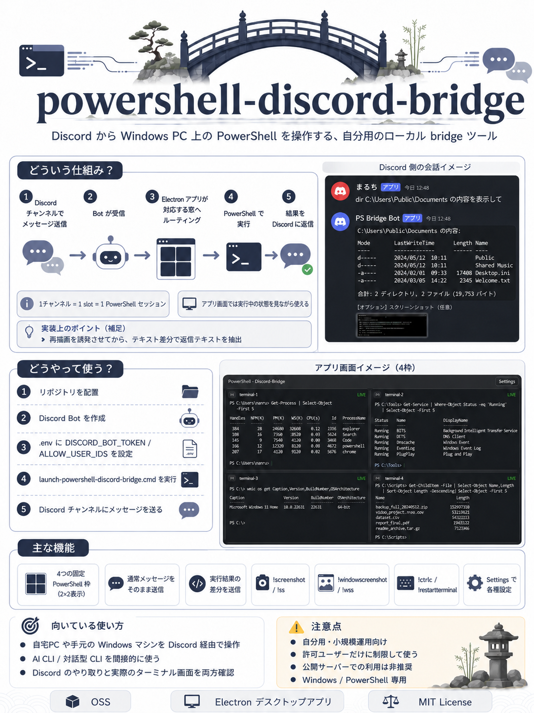

# PowerShell Discord Bridge

**Language:** 日本語 | [English](README.en.md)

<p align="center">
  
</p>

PowerShell Discord Bridge は、**自分の Windows PC 上の PowerShell を Discord から操作するためのデスクトップアプリ**です。  
Discord に送ったメッセージを PowerShell に渡し、返ってきた結果を Discord に返します。アプリ側では同じセッションの画面を見続けられるので、「今 PC 上で何が動いているか」を確認しながら使えます。

> **大事な前提**
>
> このツールは **あなたの PC 上で PowerShell を実行します**。  
> つまり、許可した Discord ユーザーから送られた内容は、あなたの PC に対する操作になります。公開サーバーに入れる汎用 bot ではなく、**自分用・小規模運用向けのローカルツール**として考えてください。

## 1枚でわかる PowerShell Discord Bridge



## 画面イメージ

### アプリ画面


### Discord 側の返答例


## できること

- Discord の 1 チャンネルを 1 つの PowerShell セッションにひも付ける
- 起動時に 4 つの固定 PowerShell 枠を自動で立ち上げる
- Discord に送った文章を、そのまま PowerShell 側へ入力する
- 実行結果の差分を Discord に返信する
- `!screenshot` / `!ss` で **対象 terminal のスクリーンショット**を Discord に返す（busy 中も即時取得、再描画誘発なし）
- `!windowscreenshot` / `!wss` で **アプリ画面全体のスクリーンショット**を Discord に返す（busy 中も即時取得）
- `!text N` / `!textN` で **現在表示中の terminal テキスト末尾**を最大 N 文字まで Discord に返す
- terminal 1 の working directory 直下に作る `discord-publish` フォルダを監視し、新規作成・更新保存したファイルを **共通 artifact チャンネル**へ自動送信する
- 実行中でも Discord / アプリ側から追加入力をそのまま流し込める
- ローカルの AI CLI / shell からも、送信先 slot をアクティブ化したうえでプレーンテキストを直接送れる
- アプリ側の terminal では `Ctrl+C` で選択テキストをコピーし、`Ctrl+V` でクリップボードのテキストを貼り付けられる
- アプリ側でも同じセッション画面を見て、進行状況や出力を確認する

## 現在の制限

- **Windows 専用**
- **PowerShell 専用**
- Discord の slash command ではなく、通常メッセージ入力ベース
- 複数のシェル（cmd / bash / zsh / WSL など）は未対応
- インストーラー付き配布ではなく、**現時点ではソースコードから起動**する形

## 先に用意するもの

導入前に、次の 4 つを用意してください。

1. **Windows PC**
2. **Node.js 20 以降**
3. **Discord アカウント**
4. **自分で管理できる Discord サーバー**

PowerShell は Windows 標準版でも動きますが、**PowerShell 7** を入れておくことをおすすめします。

## 導入手順

### 1. このリポジトリを PC に置く

Git を使う場合:

```powershell
git clone https://github.com/harunamitrader/powershell-discord-bridge.git
cd powershell-discord-bridge
```

Git を使わない場合は、GitHub の **Code > Download ZIP** からダウンロードして、わかりやすい場所に展開してください。

### 2. Discord Bot を作る

1. Discord Developer Portal を開く
2. **New Application** で新しいアプリを作る
3. **Bot** を追加する
4. Bot Token を発行して控える
5. **MESSAGE CONTENT INTENT** を有効にする
6. OAuth2 の URL Generator では **bot** scope を選び、必要な権限を付けた招待 URL を作って自分の Discord サーバーへ招待する

最低限、Bot には次の権限が必要です。

- **View Channels**（対象チャンネルを見る）
- **Send Messages**（メッセージを送る）
- **Attach Files**（ファイルを添付する）
- **Add Reactions**（リアクションを付ける）
- **Manage Channels**（channel 自動作成・名前変更・topic 更新を使う場合）

このアプリは、slot 用チャンネルや artifact チャンネル `terminal-artifacts` を**自動作成 / 再利用 / 名前更新**できます。
その機能を使うなら **Manage Channels** が必要です。既存チャンネルを自分で用意して channel ID も手動設定する運用なら、この権限は外せます。

### 3. Discord で ID をコピーできるようにする

Discord の **設定 > 詳細設定 > 開発者モード** を ON にしてください。  
これで、ユーザー ID や guild ID を右クリックからコピーできるようになります。

必要なのは次の ID です。

- **あなた自身のユーザー ID**
- **必要なら対象にしたい guild の ID**

## 4. 設定ファイルを作る

このフォルダで `.env.example` をコピーして `.env` を作ります。

```powershell
Copy-Item .env.example .env
```

`.env` をメモ帳などで開いて、最低限ここを書き換えてください。

```env
DISCORD_BOT_TOKEN=ここにBotトークン
ALLOW_USER_IDS=ここにあなたのDiscordユーザーID
```

必要なら、対象 guild を 1 つだけ指定できます。

```env
ALLOW_USER_IDS=123456789012345678,234567890123456789
ALLOW_GUILD_ID=345678901234567890
```

### 補足

- `.env` はアプリ起動時に自動で読み込まれます
- `ALLOW_GUILD_ID` を空にすると、**bot が参加している guild 内を広く対象**にします
- `ALLOW_USER_IDS` を空のまま起動すると、**安全のため誰のメッセージも受け付けません**
- 以前の名前 (`DISCORD_ALLOWED_USER_ID`, `DISCORD_ALLOWED_GUILD_IDS`) も互換のため読み取れますが、**これから設定する場合は `ALLOW_USER_IDS` / `ALLOW_GUILD_ID` を使ってください**

## 5. 初回起動

一番簡単なのは、プロジェクト直下の次のファイルを実行する方法です。

```powershell
.\launch-powershell-discord-bridge.cmd
```

この起動スクリプトは、必要なら自動で次を行います。`dist\renderer` だけでなく `dist-electron` も見て、**成果物が足りない場合やソース更新後に build が古い場合は build をやり直します。**

- `npm install`
- `npm run build`
- `npm run start`

手動でやる場合は次の通りです。

```powershell
npm install
npm run build
npm start
```

### デスクトップショートカットを作る

アプリ用アイコン付きの**デスクトップショートカット**を作る場合は、次を 1 回実行してください。

```powershell
.\install-shortcuts.cmd
```

同じことを npm script から行う場合は次でもかまいません。

```powershell
npm run setup:shortcuts
```

このショートカットは `assets\app-icon.ico` を使い、**通常はコンソールを見せない hidden launcher** 経由でアプリを起動します。起動直後は、Electron ウィンドウが出るまでの間だけ小さな起動メッセージウィンドウを表示します。`launch-powershell-discord-bridge.cmd` はそのまま残るので、デバッグしたいときだけ手動実行できます。**スタートアップには登録しません。** 以前の設定で同名のスタートアップショートカットが残っている場合は、このセットアップ実行時に削除します。

## 6. 使い方

1. アプリを起動する
2. アプリ起動時に、**4つ固定の PowerShell 枠** が自動で作成される
3. 各枠は保存済みの設定を使って、同じ Discord チャンネルに再接続される
4. 各枠の channel ID が空なら、指定 guild に Discord チャンネルが自動作成される
5. 起動時に、共通の artifact チャンネル `terminal-artifacts` も自動作成または再利用される
6. 初回起動時は terminal 1 の working directory 直下に `discord-publish` フォルダが自動作成される
7. そのチャンネルに普通のメッセージを送る
8. 対応する PowerShell 枠で Discord の内容が処理される
9. 結果が Discord に返る
10. `discord-publish` に保存したファイルは、新規作成・更新時に artifact チャンネルへ自動添付送信される
11. 右上の **Logs** を開くと、外部コンソールに出ている起動ログや bridge ログ、terminal 入力ログをアプリ内オーバーレイでも確認できる

通常の text / control リクエストが **10秒たっても完了していない場合**は、その時点の terminal スクリーンショットを**途中確認用に 1 回だけ**返します。途中スクリーンショットには `[inflight screenshot after 10s while running: terminal]` のように**現在の設定秒数付きラベル**も付きます。10秒以内に完了した場合は、この途中スクリーンショットは返さず、通常の返信テキストと auto screenshot 設定だけが適用されます。この機能は **既定で ON** で、Settings と `preferences.json` から OFF / delay 変更ができます。

通常の **text / control** を Discord から送るときは、アプリウィンドウが**非アクティブまたは最小化**されている場合、best-effort で**復元・前面化してから** terminal 入力を送ります。`!help` や screenshot 系、設定変更系コマンドでは前面化しません。

各枠は固定で、増減はできません。  
ワークスペース名を変更した場合は、対応する Discord チャンネル名も同じ名前に追従して変更されます。  
各枠の PowerShell は **Restart** で再起動できます。

### Advanced: ローカル AI / shell から slot にテキスト送信する

これは **advanced 向けのローカル自動化機能** です。通常運用は引き続き **Discord から各 slot に送る使い方** を前提にしてください。

実行中の Electron アプリは、**ローカル専用の automation endpoint** を 1 つ持ちます。これにより、Discord を経由せず **slot1-slot4 に plain text を送る**最小操作を使えます。送信時は、対象 slot を先にアプリ側でアクティブ化します。

```powershell
npm run slot:send -- --slot slot3 --text "この差分を見て"
```

- `--slot` は `1-4` / `slot1-slot4`
- `--text` を省略した場合は **stdin** から読みます
- `--no-enter` を付けると Enter なしで入力します
- 通常は送信後に **数秒待って delivery check** を行い、`likely_delivered / uncertain / likely_not_delivered` のどれかを返します
- Electron アプリが起動していない場合は失敗します

詳しい使い方と skill 設定方法は `docs\advanced-local-ai-slot-send.md` を見てください。Copilot 用の skill テンプレートは `docs\skill-examples\powershell-discord-bridge-slot-send\SKILL.md` に置いてあります。

```powershell
@'
multi-line prompt
line 2
'@ | node .\scripts\bridge-send-slot.cjs --slot slot4
```

### よく使うコマンド

- 通常のメッセージ: PowerShell へそのまま送信
- `!/command`: `/command` をそのまま Enter 付きで送る
- `!noenterTEXT`: `TEXT` を Enter なしで送る（出力待ちはしない）
- `!enter`: Enter だけ送る
- `!up` / `!up 3` / `!up3`: 上矢印キーを送る（回数は 1-20、既定は 1、初期間隔は 100ms）
- `!down` / `!down 3` / `!down3`: 下矢印キーを送る（回数は 1-20、既定は 1、初期間隔は 100ms）
- `!left` / `!left 3` / `!left3`: 左矢印キーを送る（回数は 1-20、既定は 1、初期間隔は 100ms）
- `!right` / `!right 3` / `!right3`: 右矢印キーを送る（回数は 1-20、既定は 1、初期間隔は 100ms）
- `!ctrlc`: Ctrl+C を送る
- `!esc`: Escape を送る
- `!stop`: Ctrl+C を送って進行中のリクエスト停止を試みる（止まらない場合は Restart を使う）
- `!forcestop`: 現在の terminal を強制停止して自動で再起動する
- `!restartterminal` / `!rst`: 対応する terminal slot を再起動
- `!redraw`: 対応する terminal slot に再描画 jiggle をかける
- `!restartapp` / `!rsa`: アプリ自体を再起動
- `!screenshot` / `!ss`: 対象 terminal のスクリーンショットを返す（busy 中もキューせず即時）
- `!windowscreenshot` / `!wss`: アプリ画面全体のスクリーンショットを返す（busy 中もキューせず即時）
- `!text 1000` / `!text1000`: 現在表示中の terminal テキスト末尾を最大 1000 文字まで返す
- `!autoscreenshoton`: 各返信完了後の自動スクリーンショット送信を ON
- `!autoscreenshotoff`: 各返信完了後の自動スクリーンショット送信を OFF
- `!autoscreenshot`: 現在の ON/OFF 状態を確認

通常の text / control リクエストが **設定した delay を超えて進行中** のときは、terminal に入力が届いているか確認しやすいよう、途中経過の terminal スクリーンショットを **1 回だけ**追加で返します。これは完了後の auto screenshot とは別で、delay 以内に処理が終わった場合は送信しません。既定値は **10秒 / ON** です。
- `!cols`: 現在の bridge cols を確認
- `!cols 100`: bridge cols を変更
- `!rows`: 現在の bridge rows を確認
- `!rows 50`: bridge rows を変更
- `!hardtimeout`: 現在の hard timeout を確認
- `!hardtimeoutunlimited` / `!hardtimeoutoff`: hard timeout を無制限に変更
- `!replyformat`: 現在の Discord 返信形式を確認
- `!replyformatcommand`: Discord 返信形式を code block に変更
- `!replyformattext`: Discord 返信形式を plain text に変更

`!text` は `1-9500`、`!cols` は `40-400`、`!rows` は `15-120` の範囲だけ受け付けます。範囲外や整数でない値を送った場合は、設定を変えずにエラーメッセージを返します。**通常返信と `!text` 返信の両方**で、visible text の **visual wrap 改行位置を維持**し、同じ記号の 5 文字超連続・横方向空白の 5 文字超連続・改行の 5 回超連続は 5 文字 / 5 回までに圧縮されます。`!text` の指定文字数は**この圧縮後の返信テキスト長ベース**で扱います。長い場合は通常の Discord 返信分割ルールで複数メッセージに分けます。

通常メッセージに **Discord 添付ファイル** を付けた場合は、添付を `AppData\Roaming\...\discord-bridge\incoming-files\...` に保存したうえで、次のようなコメントブロックを本文先頭に付けて terminal へ送ります。

```text
# [DISCORD_ATTACHMENTS_BEGIN]
# file[1]: "C:\...\msg-123\001-report.csv"
# file[2]: "C:\...\msg-123\002-image.png"
# [DISCORD_ATTACHMENTS_END]
```

このコメントブロックの後ろに元の本文がそのまま続きます。添付は **受信時点ですぐに保存** され、保存先は `slot-{n}\YYYY-MM-DD\msg-{messageId}` 単位で分かれます。添付は **1メッセージあたり最大 10 ファイル / 合計 10MB** までで、`!help` などの制御コマンドに添付した場合は拒否されます。本文なしで添付だけ送った場合も、**ファイルの絶対パスだけ** を載せたコメントブロックを terminal に渡します。`attachments.json` manifest は内部保存のままで、通常プロンプトには出しません。

`discord-publish` 監視では、配下の通常ファイルを **再帰監視** し、新規作成だけでなく**更新保存**でも再送します。`~$` / `.tmp` / `.crdownload` / `.part` などの一時ファイルと 0 byte ファイルは無視し、同じ内容の連続イベントは内容ハッシュで重複送信を抑えます。成功時は **添付ファイルだけ** を送り、サイズが **10MB** を超えるファイルだけは artifact チャンネルへエラーメッセージを送ります。

screen diff の中間アンカー長は、既定値を **500 文字から 300 文字へ変更**し、`preferences.json` の `bridgeSettings.diffAnchorChars` と Settings から調整できるようにしています。短くすると差分開始位置を後ろへ寄せやすくなる一方で、似た文字列が多い画面では誤アンカーの可能性も少し上がります。

設定は Electron アプリ右上の **Settings** から開きます。  
設定は **Global** と **Per terminal** に分かれています。

- **Global:** 自動スクリーンショット送信 ON/OFF、Discord reply format、soft timeout / hard timeout、bridge 用の固定 cols / rows（rows の最小値は `15`）
- **Global:** Delayed inflight terminal screenshot（既定値 `ON`）と inflight screenshot delay（既定値 `10s`、`preferences.json` の `bridgeSettings.inflightScreenshotOnRunningRequest` / `bridgeSettings.timing.inflightScreenshotDelaySeconds`）
- **Global:** Artifact publish folder（初期値は terminal 1 の cwd 直下の `discord-publish`、送信先チャンネルは自動作成される `terminal-artifacts`）
- **Global:** screen diff anchor chars（既定値 `300`、`preferences.json` の `bridgeSettings.diffAnchorChars` に保存）
- **Global:** bridge timing（ms 単位の redraw/input/Enter/repeat key 待機）に加えて、completion 判定、manual redraw、live view publish、screenshot capture、app restart、attachment download の待機・timeout も変更でき、設定は `%APPDATA%\PowerShell Discord Bridge\preferences.json` の `bridgeSettings.timing` に保存されます
- **Per terminal:** ワークスペース名、Discord channel ID、その枠の default working directory

初期値は次のとおりです。

- Auto screenshot after reply: `ON`
- Delayed inflight terminal screenshot: `ON`
- Discord reply format: `code block`
- Soft timeout: `300s`
- Hard timeout: `unlimited`（入力欄の表示値は `7200s`）
- Bridge size: `100 cols x 50 rows`
- Inflight screenshot delay: `10000ms`
- Artifact publish folder: `terminal 1 cwd\discord-publish`
- Screen diff anchor chars: `300`
- Bridge timing: text 送信前後の待機に加えて、completion settle / no-output / poll、manual redraw、live view publish、screenshot capture、app restart、attachment download timeout も個別に調整可能

## はじめて使うときのおすすめ確認

最初は、許可したチャンネルで次のような安全な入力から始めるのがおすすめです。

```text
Get-Date
```

返答が返ってきたら、次に次のような軽い確認をします。

```text
Get-Location
```

## うまく動かないとき

### Discord に何も返ってこない

次を確認してください。

- `DISCORD_BOT_TOKEN` が正しいか
- `ALLOW_USER_IDS` に自分のユーザー ID が入っているか
- `ALLOW_GUILD_ID` を設定している場合、その guild ID が正しいか
- Bot がそのチャンネルを読めるか
- Discord Developer Portal で **MESSAGE CONTENT INTENT** を有効にしたか

### アプリは起動するが PowerShell が期待どおり動かない

- PowerShell 7 を入れているか
- 会社 PC などで実行ポリシーやセキュリティ制限が強すぎないか
- ローカルで PowerShell 自体は普通に起動できるか

### 起動に失敗する

- Node.js 20 以降が入っているか
- 一度プロジェクトフォルダで `npm install` をやり直す

## 安全に使うための注意

- このツールは **許可した Discord メッセージを自分の PC に流し込む** ものです
- 公開サーバーや不特定多数が書き込めるチャンネルでは使わないでください
- `ALLOW_USER_IDS` は必ず絞ってください
- 必要なら `ALLOW_GUILD_ID` で guild を絞ってください
- `.env` は Git にコミットしないでください

## 公開ドキュメント

- English README: `README.en.md`
- 公開仕様書: `docs/public-spec.md`
- English public spec: `docs/public-spec.en.md`
- 更新履歴: `CHANGELOG.md`

## ライセンス

MIT
